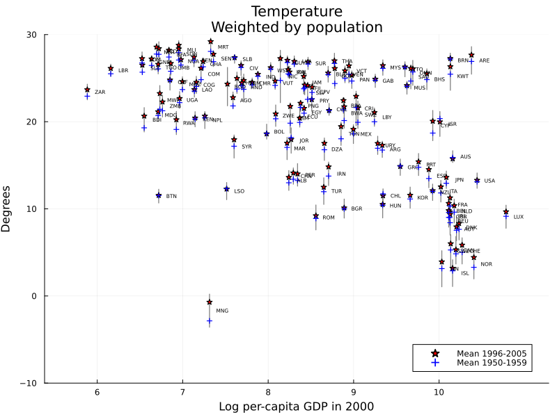
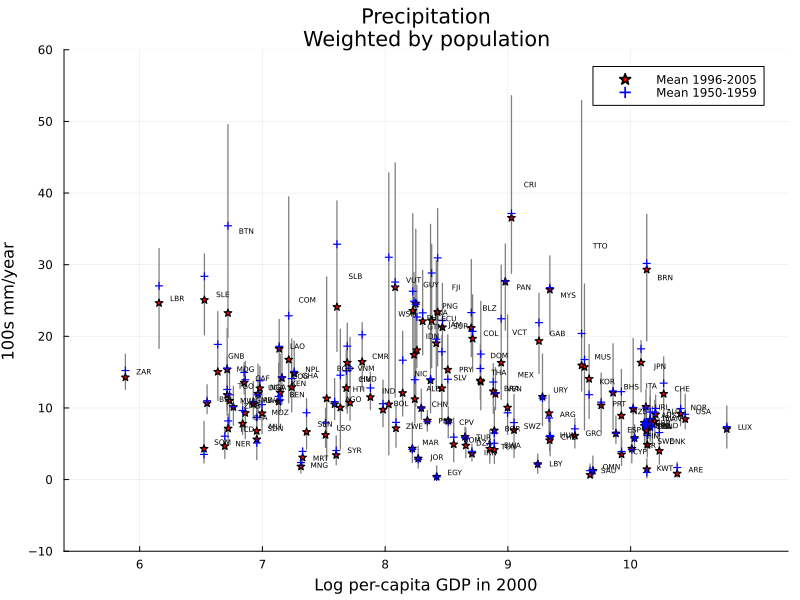

```@meta
CurrentModule = DellReplicate
```
# Functions for Figure 1.

This page contains the functions used to generate ` Figure 1` of Dell (2012). The function `gen_vars_fig1!` is specific to `Figure 1` and is used inside `figure1_data_cleaner`. The two remaining functions are mainly used for saving and viewing the resulting graphs.

## Graph 1: Temperature


## Graph 2: Precipitation


## Functions
```@docs
gen_vars_fig1!
figure1_data_cleaner
figure1_visualise_graph1
figure1_visualise_graph2
```