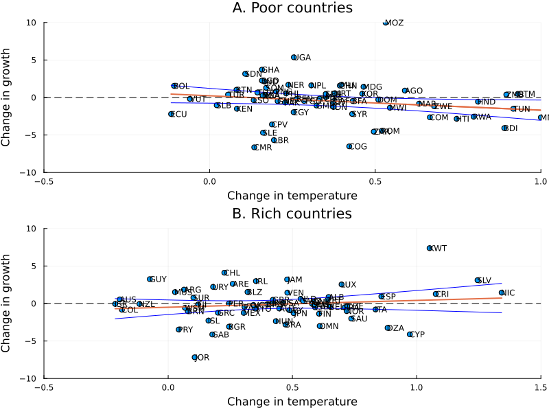

```@meta
CurrentModule = DellReplicate
```

# Functions for Figure 2

This page contains the functions used to generate ` Figure 2` of Dell (2012). The function `figure2_visualize` is generates both plots and combines them in one. The only extra function we use for this part is HCE which is a way to obtain robust standard errors without using any precompiled packages.



```@docs
figure2_visualise
HCE
```